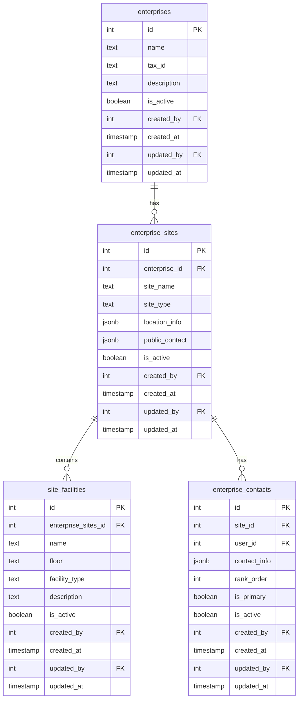
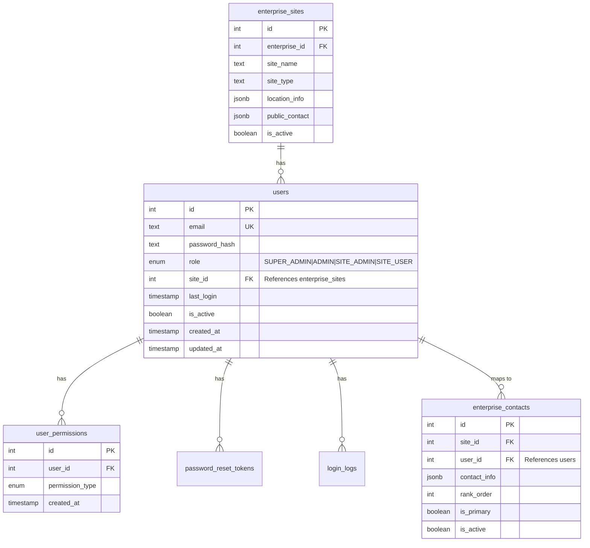
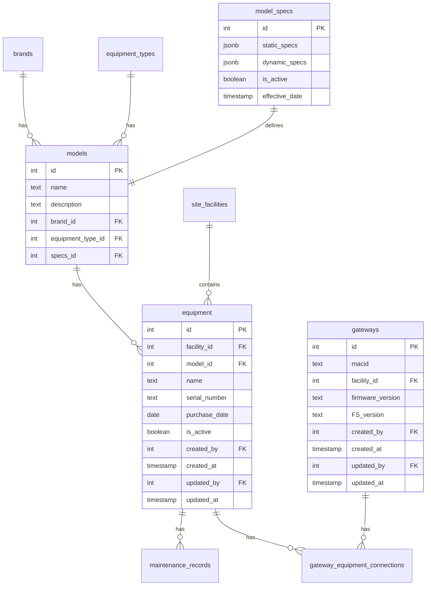

```mermaid
erDiagram
    %% 企業與組織管理模組
    enterprises ||--o{ enterprise_sites : has
    enterprise_sites ||--o{ site_facilities : contains
    enterprise_sites ||--o{ enterprise_contacts : has

    enterprises {
        int id PK
        text name
        text tax_id
        text description
        boolean is_active
        int created_by FK
        timestamp created_at
        int updated_by FK
        timestamp updated_at
    }

    enterprise_sites {
        int id PK
        int enterprise_id FK
        text site_name
        text site_type
        jsonb location_info
        jsonb public_contact
        boolean is_active
        int created_by FK
        timestamp created_at
        int updated_by FK
        timestamp updated_at
    }

    site_facilities {
        int id PK
        int enterprise_sites_id FK
        text name
        text floor
        text facility_type
        text description
        boolean is_active
        int created_by FK
        timestamp created_at
        int updated_by FK
        timestamp updated_at
    }

    enterprise_contacts {
        int id PK
        int site_id FK
        int user_id FK
        jsonb contact_info
        int rank_order
        boolean is_primary
        boolean is_active
        int created_by FK
        timestamp created_at
        int updated_by FK
        timestamp updated_at
    }
```

```mermaid
erDiagram
    %% 用戶管理模組和企業據點的關聯
    enterprise_sites ||--o{ users : has
    users ||--o{ user_permissions : has
    users ||--o{ password_reset_tokens : has
    users ||--o{ login_logs : has
    users ||--o{ enterprise_contacts : "maps to"

    users {
        int id PK
        text email UK
        text password_hash
        enum role "SUPER_ADMIN|ADMIN|SITE_ADMIN|SITE_USER"
        int site_id FK "References enterprise_sites"
        timestamp last_login
        boolean is_active
        timestamp created_at
        timestamp updated_at
    }

    enterprise_sites {
        int id PK
        int enterprise_id FK
        text site_name
        text site_type
        jsonb location_info
        jsonb public_contact
        boolean is_active
    }

    user_permissions {
        int id PK
        int user_id FK
        enum permission_type
        timestamp created_at
    }

    enterprise_contacts {
        int id PK
        int site_id FK
        int user_id FK "References users"
        jsonb contact_info
        int rank_order
        boolean is_primary
        boolean is_active
    }
```

```mermaid
erDiagram
    %% 設備規格和實例管理模組
    brands ||--o{ models : has
    equipment_types ||--o{ models : has
    models ||--o{ equipment : has
    model_specs ||--|| models : defines
    site_facilities ||--o{ equipment : contains
    equipment ||--o{ maintenance_records : has
    gateways ||--o{ gateway_equipment_connections : has
    equipment ||--o{ gateway_equipment_connections : has

    equipment {
        int id PK
        int facility_id FK
        int model_id FK
        text name
        text serial_number
        date purchase_date
        boolean is_active
        int created_by FK
        timestamp created_at
        int updated_by FK
        timestamp updated_at
    }

    models {
        int id PK
        text name
        text description
        int brand_id FK
        int equipment_type_id FK
        int specs_id FK
    }

    model_specs {
        int id PK
        jsonb static_specs
        jsonb dynamic_specs
        boolean is_active
        timestamp effective_date
    }

    gateways {
        int id PK
        text macid
        int facility_id FK
        text firmware_version
        text FS_version
        int created_by FK
        timestamp created_at
        int updated_by FK
        timestamp updated_at
    }
```